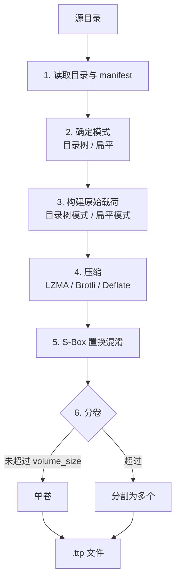

# 打包流程

### 各步骤说明

1. **读取目录与 manifest** — 递归遍历文件，读取 `manifest.json`，构建内存文件树。
2. **确定模式** — 有子目录→目录树模式，无子目录→扁平模式，`--flat` 强制扁平。
3. **构建原始载荷** — 目录树模式：JSON 元数据 + 文件块 + 自定义；扁平模式：[扩展]文件头 + 文件条目列表 + manifest + 自定义。
4. **压缩** — 可选 LZMA / Brotli / Deflate。
5. **S-Box 置换混淆** — `obfuscated[i] = forward[comp[i]]`。
6. **分卷（可选）** — 未超过 `volume_size` 输出单卷，否则分割为多个 `.ttp` 文件。

## 模式自动选择

- 如果源目录不含子文件夹 → 自动使用扁平模式
- 如果源目录含子文件夹 → 自动使用目录树模式
- `--flat` 强制扁平模式，此时若有子文件夹则报错

## ExtInfo 自动检测

仅扁平模式有效，满足任一条件时自动启用：
- 文件数 > 65535
- 任一文件大小 ≥ `0xFFFFFFFF`（4 GiB − 1）
