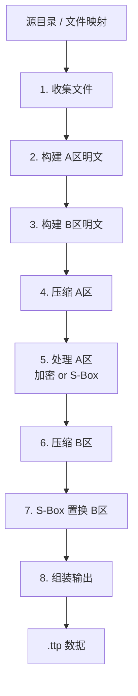

# 打包流程

### 各步骤说明

1. **收集文件** — 递归遍历目录，收集所有文件路径和内容。路径分隔符统一为 `/`。静默跳过空目录。

2. **构建 A区明文** — 文件数量(uint32) + 路径条目(路径长度+路径+内容长度+内容)。

3. **构建 B区明文** — Manifest(可选) + 自定义数据(可选)。两者均不存在则 B区不存在。

4. **压缩 A区** — 使用指定压缩算法（LZMA/Brotli/Deflate）。

5. **处理 A区** — 加密模式：AES-256-GCM 加密（Salt+IV+密文）。未加密模式：S-Box 正向置换。

6. **压缩 B区** — 使用指定压缩算法。

7. **S-Box 置换 B区** — B区始终只做压缩+S-Box，不加密。

8. **组装输出** — 头部(26B) + A区长度(4B) + A区 + B区(如有)。

## 模式自动选择

JS 版本中，`packTTP()` 接收 `Map<string, Uint8Array>` 作为输入，无需判断目录结构。

## ExtInfo 自动检测

已废除。文件数量固定为 uint32，文件内容长度固定为 uint64。
