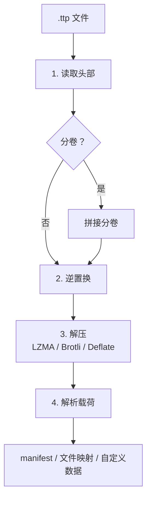

# 解包流程

### 各步骤说明

1. **读取头部** — 验证魔数 `TTP\x01`、版本号 == 1、解析 config byte 0。
2. **分卷拼接** — 若为分卷文件，按 `001+002+…` 顺序拼接。
3. **逆置换** — `compressed[i] = backward[obfuscated[i]]`，还原压缩数据。
4. **解压** — 根据 compression 字段选择 LZMA / Brotli / Deflate 解压。
5. **解析载荷** — 根据 Flat 和 ExtInfo 标记提取文件条目和 manifest；若 HasCustom 提取自定义数据。

## 分卷拼接细节

1. 识别文件名是否匹配 `.ttp.\d{3}$`
2. 从 `001` 开始顺序扫描，遇到不存在的文件停止
3. 读取第一分卷头部的总卷数字段
4. 若实际找到数量 < 预期总数，发出警告
5. 所有数据体按序号拼接后统一处理
