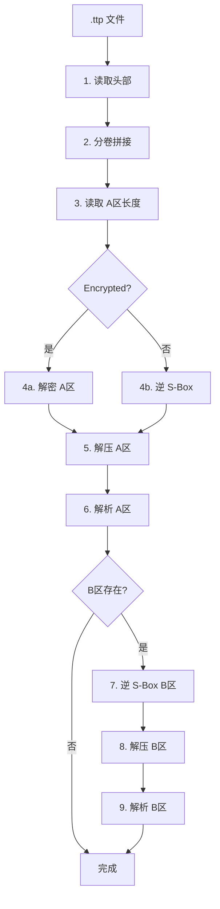

# 解包流程



### 各步骤说明

1. **读取头部** — 验证魔数 `TTP\x01`、版本号 == 1、解析配置字节 0。

2. **分卷拼接** — 若为分卷文件，按 `001+002+…` 顺序拼接。

3. **读取 A区长度** — 读取 4 字节 uint32 LE，确定 A区边界。

4. **解密/逆置换 A区** — 加密模式：用 password 派生密钥解密（Salt+IV+Ciphertext）。未加密模式：S-Box 逆向置换。

5. **解压 A区** — 根据 compression 字段选择 LZMA/Brotli/Deflate。

6. **解析 A区** — 读取文件数量，逐条解析路径条目（路径长度+路径+内容长度+内容）。

7. **B区处理** — 如果 HasManifest 或 HasCustom 为 1，读取剩余数据：逆 S-Box → 解压 → 解析 Manifest 和自定义数据。

## 分卷拼接细节

1. 识别文件名是否匹配 `.ttp.\d{3}$`
2. 从 `001` 开始顺序扫描，遇到不存在的文件停止
3. 读取第一分卷头部的总卷数字段
4. 若实际找到数量 < 预期总数，发出警告
5. 所有数据体按序号拼接后统一处理

## 路径安全

解包时必须检测路径穿越攻击：

```python
target_path = os.path.join(output_dir, path.replace('/', os.sep))
if not os.path.realpath(target_path).startswith(os.path.realpath(output_dir)):
    raise SecurityError("检测到路径穿越攻击")
```
